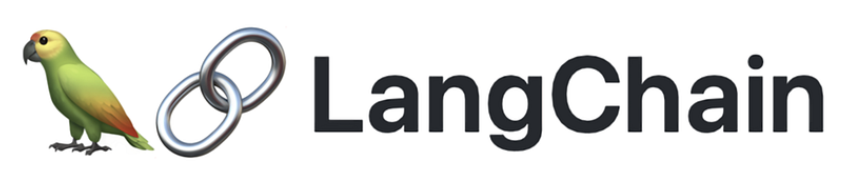

# LangChain-Course
A collection of mini-projects covering sub-topics in LangChain.

[LangChain](https://python.langchain.com/v0.2/docs/introduction/) is a framework for developing applications powered by large language models (LLMs). LangChain supports the development, deployment and monitoring/LLMOps of an LLM-powered application.

## Important Subcomponents

* **LangSmith** : Monitors, debugs, and tests LLM applications, offering a dashboard for analytics and insights into performance and usage patterns.  
* **LangServe** : Utilizes FastAPI for quick and easy deployment of LLM-powered applications, ensuring accessibility and scalability.  
* **LangChain Cognitive Architecture** :  
     * **Chains** : Sequences of operations or steps to accomplish tasks, modularizing workflows for easier building and maintenance.  
     * **Agents** : Components responsible for retrieving and processing information to fulfill user queries.  
     * **Retrieval Strategies** : Mechanisms enabling agents to access necessary data, ensuring accurate and relevant responses.  
* **LangChain-Community** :  
     * **Model I/O** : Handles input and output interactions with third-party models.
     * **Retrieval** : Integrates with external data sources for information retrieval.    
     * **Agent Tooling** : Provides tools and integrations for enhancing agent capabilities.  
* **LangChain-Core** :
     * **Protocols** : Defines standards and interfaces for consistent and efficient operation.  
     * **LCEL (LangChain Expression Language)** : A language for defining and manipulating expressions within LangChain applications.  